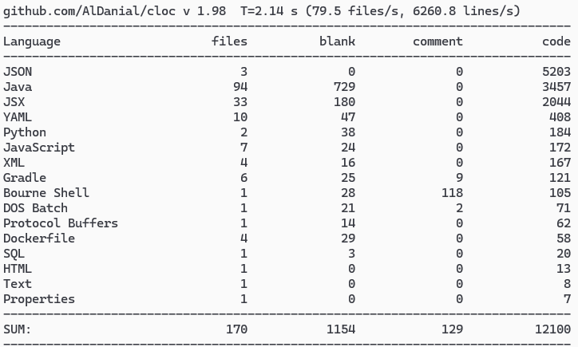

# Data Quality Сheck System — Монорепозиторий

Этот репозиторий объединяет все сервисы системы контроля качества данных в рамках единого монорепозитория. Каждый сервис размещён в отдельной подпапке.

---

## Сервисы

| Название сервиса                             | Описание                                      | Отдельный репозиторий                               |
|----------------------------------------------|-----------------------------------------------|-----------------------------------------------------|
| `kafka_consumer_service`                     | Kafka Consumer для получения событий данных    | [Перейти](https://github.com/lrnvkrt/kafka_consumer_service) |
| `kafka_producer_service`                     | Kafka Producer для генерации тестовых событий | [Перейти](https://github.com/lrnvkrt/kafka_producer_service) |
| `data_quality_service`                       | Основной backend-сервис, управляющий правилами, аналитикой и валидацией | [Перейти](https://github.com/lrnvkrt/data_quality_service) |
| `data_quality_web`                           | Веб-интерфейс для управления и визуализации   | [Перейти](https://github.com/lrnvkrt/data_quality_web)    |
| `expectations_check_service`                 | Python-сервис, интегрированный с Great Expectations | [Перейти](https://github.com/lrnvkrt/expectations_check_service) |

---

## Объём кода

Актуальный замер количества строк кода, выполненный с помощью `cloc`

  

---
